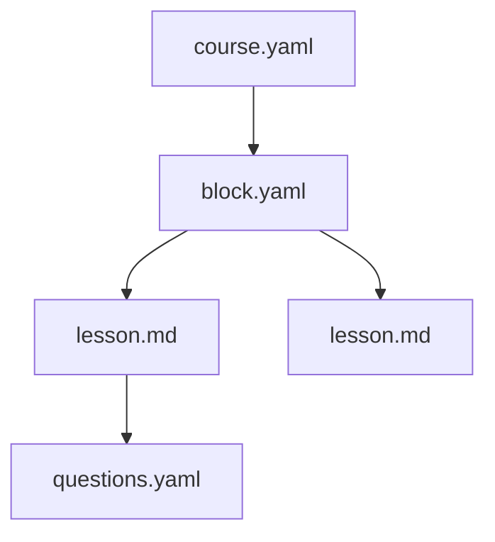

# Setting Up Obsidian

The course template already contains `.obsidian/` with the correct settings. But it's useful to understand what's inside.

## What's configured

| Setting                          | Purpose                                                |
| -------------------------------- | ------------------------------------------------------ |
| `useMarkdownLinks: true`         | Links in `[text](path)` format, not `[[wiki]]`        |
| `attachmentFolderPath: ./assets` | Images dropped in go to `assets/`                      |
| `userIgnoreFilters`              | `_templates/`, `.github/`, `docs/` hidden from file tree |
| Templates plugin                 | Question templates available via Cmd+P                 |

## Templates

In `_templates/obsidian/` there are snippets. Use them via **Cmd+P** → **"Insert template"**:

- `lesson-frontmatter` — header for a new lesson
- `question-multiple-choice` — multiple choice question
- `question-true-false` — true/false question
- `directive-callouts` — all callout types

> [!tip] Graph View
> Use Graph View to visualize connections between lessons.
> Especially useful for large courses with 10+ lessons.

## Mermaid diagrams

Obsidian renders Mermaid natively (if the plugin is enabled):

On the StudyMe platform this renders the same way.

> [!quiz] obsidian-links

> [!quiz] assets-folder
