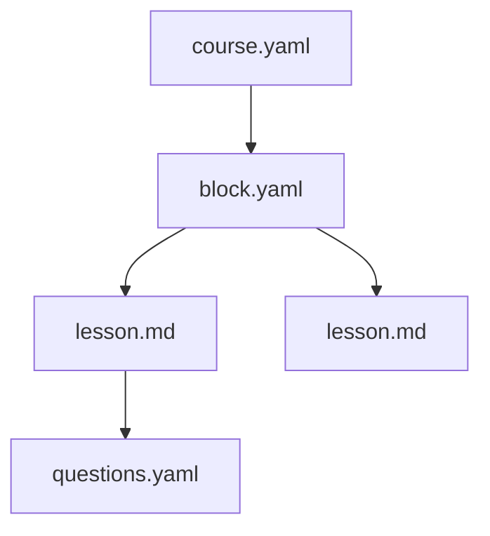

# Настройка Obsidian

Шаблон курса уже содержит `.obsidian/` с правильными настройками. Но полезно понять что там внутри.

## Что настроено

| Настройка | Зачем |
|-----------|-------|
| `useMarkdownLinks: true` | Ссылки в формате `[text](path)`, не `[[wiki]]` |
| `attachmentFolderPath: ./assets` | Картинки при drag-n-drop попадают в `assets/` |
| `userIgnoreFilters` | Скрыты `_templates/`, `.github/`, `docs/` из file tree |
| Templates plugin | Шаблоны для вопросов доступны через Cmd+P |

## Шаблоны (Templates)

В `_templates/obsidian/` лежат сниппеты. Используй через **Cmd+P** → **"Insert template"**:

- `lesson-frontmatter` — шапка для нового урока
- `question-multiple-choice` — вопрос с выбором
- `question-true-false` — вопрос да/нет
- `directive-callouts` — все типы callouts

> [!tip] Graph View
> Используй Graph View для визуализации связей между уроками.
> Особенно полезно для больших курсов с 10+ уроками.

## Mermaid-диаграммы

Obsidian рендерит Mermaid нативно (если плагин включён):

На платформе StudyMe это рендерится так же.

> [!quiz] obsidian-links
