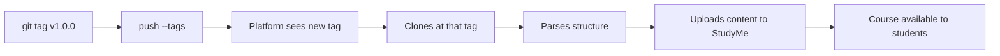

# Tags and Versions

The platform indexes a course **only by Git tags**. Intermediate commits to main are not visible to students.

## Creating a tag

When the course is ready for publishing:

```bash
git add .
git commit -m "feat: first version of the course"
git tag v1.0.0
git push origin main --tags
```

> [!info] Semver
> Use semantic versioning:
> - **MAJOR** (v2.0.0) — major overhaul
> - **MINOR** (v1.1.0) — new lessons
> - **PATCH** (v1.0.1) — typo fixes

## UUID

Every entity (course, block, lesson, question) has a stable UUID in the `id:` field.

**You don't need to fill it in manually!** The GitHub Action `studyme-course-tools` will automatically fill in empty `id:` fields when a PR is opened.

> [!warning] Never change a UUID
> The UUID is linked to student progress. If you change it — everyone loses their progress on that element.

## What happens when a tag is created



> [!quiz] uuid-change

> [!quiz] platform-indexing
