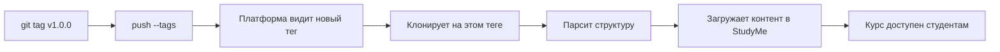

# Теги и версии

Платформа индексирует курс **только по тегам Git**. Промежуточные коммиты в main студентам не видны.

## Создание тега

Когда курс готов к публикации:

```bash
git add .
git commit -m "feat: first version of the course"
git tag v1.0.0
git push origin main --tags
```

> [!info] Semver
> Используйте семантическое версионирование:
> - **MAJOR** (v2.0.0) — крупная переработка
> - **MINOR** (v1.1.0) — новые уроки
> - **PATCH** (v1.0.1) — исправление опечаток

## UUID

Каждая сущность (курс, блок, урок, вопрос) имеет стабильный UUID в поле `id:`.

**Не нужно заполнять вручную!** GitHub Action `studyme-course-tools` автоматически заполнит пустые `id:` при открытии PR.

> [!warning] Никогда не меняйте UUID
> UUID привязан к прогрессу студентов. Если изменить — все потеряют свой прогресс по этому элементу.

## Что происходит при создании тега



> [!quiz] uuid-change

> [!quiz] platform-indexing
