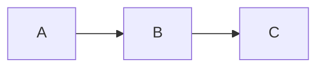

# Callouts and Widgets

StudyMe uses Obsidian callout syntax. What you see in Obsidian is what students see on the platform.

## Informational callouts

```markdown
> [!info] Title
> Info text.

> [!tip] Tip
> A useful tip.

> [!warning] Attention
> An important warning.
```

> [!info] Example
> This is how it looks on the platform.

> [!warning] Note
> All Obsidian callout types are supported: note, tip, info, warning,
> danger, success, question, example, quote, todo, and others.

## Collapsible callouts

Add `+` (expanded) or `-` (collapsed) after the type:

```markdown
> [!hint]- Hint (click to expand)
> Hidden text.

> [!example]+ Example (expanded by default)
> Visible text.
```

> [!hint]- Try expanding this
> This is how collapsible hints work.

## Interactive widgets

Three special callout types for StudyMe:

| Syntax | What it does |
|--------|-------------|
| `> [!quiz] slug` | Embeds a question from questions.yaml |
| `> [!challenge] slug` | Embeds a code challenge (V3) |
| `> [!sandbox] lang` | Embeds a sandbox (V3) |

In Obsidian they display as regular callouts. On the platform — as real widgets.

## Mermaid diagrams

Use a standard fenced code block:

````markdown

````

Works in both Obsidian (with plugin) and on the platform.

> [!quiz] callout-syntax

> [!quiz] quiz-callout-syntax
