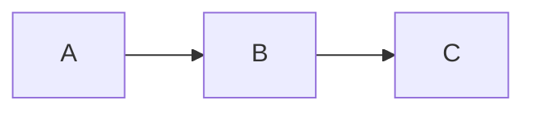

# Callouts и виджеты

StudyMe использует Obsidian-синтаксис callouts. Что видите в Obsidian — то студент увидит на платформе.

## Информационные callouts

```markdown
> [!info] Заголовок
> Текст подсказки.

> [!tip] Совет
> Полезный совет.

> [!warning] Внимание
> Важное предупреждение.
```

> [!info] Пример
> Вот так это выглядит на платформе.

> [!warning] Обратите внимание
> Все callout-типы Obsidian поддерживаются: note, tip, info, warning,
> danger, success, question, example, quote, todo и другие.

## Сворачиваемые callouts

Добавьте `+` (развёрнут) или `-` (свёрнут) после типа:

```markdown
> [!hint]- Подсказка (нажмите чтобы раскрыть)
> Скрытый текст.

> [!example]+ Пример (развёрнут по умолчанию)
> Видимый текст.
```

> [!hint]- Попробуйте раскрыть
> Вот так работают сворачиваемые подсказки.

## Интерактивные виджеты

Три специальных типа callouts для StudyMe:

| Синтаксис | Что делает |
|-----------|-----------|
| `> [!quiz] slug` | Встраивает вопрос из questions.yaml |
| `> [!challenge] slug` | Встраивает код-задачу (V3) |
| `> [!sandbox] lang` | Встраивает песочницу (V3) |

В Obsidian они отображаются как обычные callouts. На платформе — как реальные виджеты.

## Mermaid-диаграммы

Используйте стандартный fenced code block:

````markdown

````

Работает и в Obsidian (с плагином), и на платформе.

> [!quiz] callout-syntax

> [!quiz] quiz-callout-syntax
